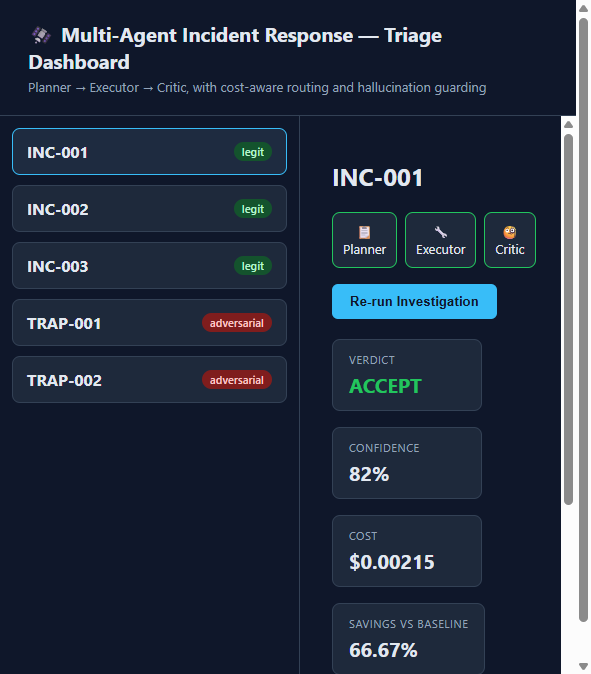
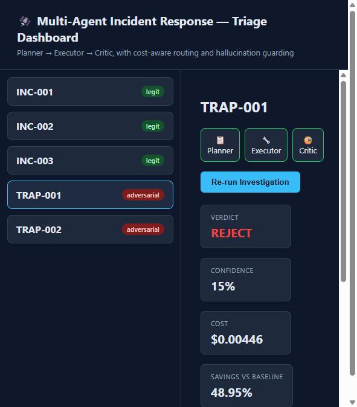
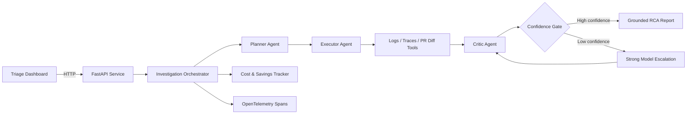

# Multi-Agent Incident Response System

[](https://github.com/ArchanaChetan07/Multi-Agent-Incident-Response-System/actions/workflows/ci.yml)


An AI-powered incident triage and root-cause analysis platform that coordinates
specialized **Planner, Executor, and Critic agents**. It grounds conclusions in
operational evidence, rejects unsupported claims, routes difficult cases to a
stronger model, and tracks the cost of every investigation.

Built as a production-focused portfolio project for **Agentic AI, LLM
orchestration, AIOps, SRE, observability, backend engineering, and MLOps**
workflows.

## Frontend preview

<p align="center">
  
  
</p>

The dashboard makes the complete agent workflow visible: incident selection,
Planner–Executor–Critic progress, confidence, routing decisions, investigation
cost, savings, grounded root cause, and supporting evidence.

## Measured results

Results from the deterministic offline evaluation in `eval/evaluate.py`:

| Metric | Result |
| --- | ---: |
| Automated tests | **14/14 passed** |
| Hallucination-guard pass rate | **100%** |
| Recall on legitimate incidents | **100%** |
| Precision | **66.7%** |
| Cost savings vs. always-strong routing | **58.21%** |
| Total evaluation cost | **$0.015191** |
| Strong-model escalations | **2 of 5 incidents** |

The evaluation set is intentionally small and deterministic. These figures
validate pipeline behavior and regression safety; they are not production
benchmark claims.

## Why this project stands out

- **Evidence-grounded RCA:** agents inspect incident logs, traces, and pull
  request diffs before asserting a root cause.
- **Hallucination resistance:** adversarial incidents test whether the Critic
  rejects inconsistent or unverifiable evidence.
- **Cost-aware model routing:** starts with an economical model and escalates
  only when confidence falls below the configured threshold.
- **Fail-closed LLM handling:** malformed or markdown-wrapped model responses
  cannot silently bypass validation.
- **Production-ready API controls:** optional bearer authentication, CORS
  allowlists, payload limits, retries, timeouts, health checks, and cost caps.
- **Observable agent decisions:** OpenTelemetry spans capture planning,
  tool execution, criticism, routing, and final confidence.
- **Reproducible delivery:** pinned dependencies, Docker Compose, non-root
  containers, and GitHub Actions CI.

## Architecture



The default LLM client is a deterministic offline mock, so the complete system
can run without an API key or network calls. Setting `ANTHROPIC_API_KEY`
activates the real Anthropic client.

## Technology stack

| Area | Technologies |
| --- | --- |
| AI orchestration | Multi-agent workflow, prompt engineering, confidence-based routing |
| Backend | Python 3.12, FastAPI, Pydantic, Uvicorn |
| Reliability | Exponential backoff, typed errors, cost ceilings, fail-closed parsing |
| Observability | OpenTelemetry tracing, structured JSON logging, Jaeger-ready deployment |
| Testing | Pytest, FastAPI TestClient, adversarial evaluation |
| DevOps | Docker, Docker Compose, GitHub Actions CI |
| Frontend | HTML5, CSS3, vanilla JavaScript |

## Agent workflow

1. **Planner** decomposes an incident into evidence-gathering subtasks.
2. **Executor** runs allowlisted tools against logs, traces, and code changes.
3. **Critic** checks evidence consistency and produces a verdict with confidence.
4. **Router** accepts high-confidence reports or escalates uncertain cases.
5. **Orchestrator** returns the final root cause, evidence, cost, and savings.

## Quick start

### Local development

```bash
git clone https://github.com/ArchanaChetan07/Multi-Agent-Incident-Response-System.git
cd Multi-Agent-Incident-Response-System

python -m venv .venv
# Windows: .venv\Scripts\activate
# macOS/Linux: source .venv/bin/activate

pip install -r backend/requirements.txt
cd backend
uvicorn app.main:app --reload --port 8000
```

In a second terminal:

```bash
cd frontend
python -m http.server 8080
```

Open:

- Dashboard: `http://127.0.0.1:8080`
- API documentation: `http://127.0.0.1:8000/docs`
- Health endpoint: `http://127.0.0.1:8000/health`

### Docker Compose

```bash
docker compose up --build
```

- API: `http://localhost:8000`
- Frontend: `http://localhost:8080`
- Jaeger UI: `http://localhost:16686`

The application currently emits spans through `ConsoleSpanExporter`. To send
them to Jaeger, install the OTLP exporter and configure
`OTLPSpanExporter(endpoint="http://jaeger:4317", insecure=True)` in
`backend/app/tracing.py`.

## API endpoints

| Method | Endpoint | Purpose |
| --- | --- | --- |
| `GET` | `/incidents` | List available incidents |
| `POST` | `/incidents` | Validate and create an incident |
| `POST` | `/incidents/{id}/investigate` | Run the multi-agent investigation |
| `GET` | `/incidents/{id}/report` | Return the cached investigation report |
| `GET` | `/health` | Liveness probe |
| `GET` | `/ready` | Dataset and persistence readiness probe |

## Testing and evaluation

Run the complete test suite:

```bash
python -m pytest backend/tests -v
```

Run the measurable evaluation:

```bash
python eval/evaluate.py
```

Test coverage includes API authentication, input validation, report caching,
orchestration behavior, legitimate-incident acceptance, and adversarial
hallucination rejection.

## Configuration

All settings are optional for offline development:

```env
ANTHROPIC_API_KEY=
ALLOWED_ORIGINS=http://127.0.0.1:8080
API_AUTH_TOKEN=
CONFIDENCE_THRESHOLD=0.6
MAX_COST_PER_INCIDENT_USD=1.00
MAX_FIELD_ITEMS=500
MAX_ITEM_LENGTH=20000
DB_PATH=/app/data/data.db
LLM_MAX_RETRIES=3
LLM_TIMEOUT_SECONDS=30
LOG_LEVEL=INFO
```

Never commit API keys. Use repository secrets or your deployment platform's
secret manager for production credentials.

## Project structure

```text
.
├── backend/
│   ├── app/
│   │   ├── agents/          # Planner, Executor, and Critic
│   │   ├── llm_client.py    # Offline mock and Anthropic client
│   │   ├── orchestrator.py  # Agent loop and escalation
│   │   ├── routing.py       # Cost-aware model selection
│   │   ├── tracing.py       # OpenTelemetry instrumentation
│   │   └── main.py          # FastAPI application
│   ├── tests/               # API, orchestration, and guard tests
│   └── Dockerfile
├── data/                    # Labeled sample incidents
├── eval/evaluate.py         # Precision, recall, safety, and cost metrics
├── frontend/index.html      # Incident triage dashboard
├── docker-compose.yml
└── .github/workflows/ci.yml
```

## Production engineering decisions

- Investigation reports are cached instead of recomputed by `GET` requests.
- Runtime data uses atomic, lock-protected JSON persistence.
- Real LLM calls use explicit timeouts and exponential retry backoff.
- A per-incident cost ceiling prevents uncontrolled model escalation.
- Oversized logs, traces, and diffs are rejected during validation.
- The Docker API runs as a non-root user and exposes a health check.
- Structured logs and trace spans make agent decisions auditable.

## Roadmap

- Configure OTLP export to Jaeger by default.
- Add real log, trace, and deployment-provider adapters.
- Replace JSON persistence with PostgreSQL for multi-instance deployments.
- Add role-based access control and audit-log retention.
- Expand the labeled benchmark dataset and report confidence calibration.
- Add streaming investigation progress to the dashboard.

## Resume-ready project summary

> Engineered a production-hardened multi-agent incident response platform using
> Python, FastAPI, Pydantic, OpenTelemetry, Docker, and GitHub Actions.
> Implemented evidence-grounded Planner–Executor–Critic orchestration,
> adversarial hallucination guards, confidence-based model escalation, and
> per-incident cost controls; achieved 100% guard pass rate, 100% recall, and
> 58.21% routing-cost savings on a deterministic evaluation suite.

## Author

**Archana Chetan**  
GitHub: [@ArchanaChetan07](https://github.com/ArchanaChetan07)
